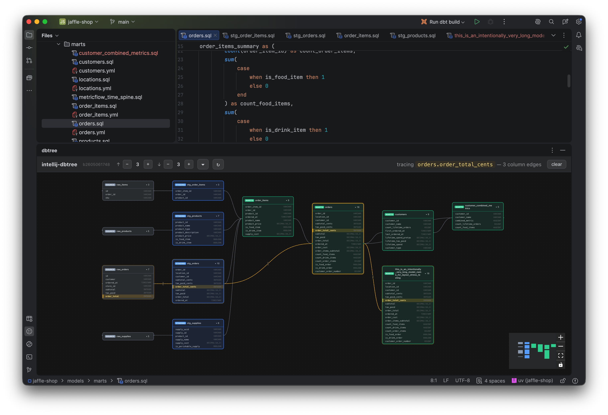

# dbtree — column-level dbt lineage for JetBrains IDEs

[](https://github.com/kouko/intellij-dbtree/releases)
[](https://github.com/kouko/intellij-dbtree/actions/workflows/build.yml)
[](LICENSE)

Visualize [dbt](https://www.getdbt.com/) model lineage inside JetBrains IDEs with **column-level** tracing powered by [sqlglot](https://github.com/tobymao/sqlglot). Successor to the archived [`ramonvermeulen/dbt-toolkit`](https://github.com/ramonvermeulen/dbt-toolkit).



## Features

- **Interactive model DAG** rendered with React Flow + dagre, embedded via JCEF
- **Column-to-column lineage** across CTEs, JOINs, UNIONs, and window functions
- **Click a column** to highlight every upstream and downstream column it touches
- Reads dbt `manifest.json` + `catalog.json` (real warehouse types when available)
- IDE theme integration (light / dark)
- Drag-to-rearrange nodes; click model card name to open the file; configurable hop depth (`0`, `1`, `2`, `3`, `5`, `10`, `∞`)
- Auto-detects the project's Python interpreter — no extra setup on DataSpell / PyCharm / IntelliJ + Python plugin
- Compatible with any IntelliJ-based IDE on build 261+ (developed against DataSpell 2026.1.1)

## Install

Download the latest `dbtree-<version>.zip` from the [Releases](https://github.com/kouko/intellij-dbtree/releases) page, then in your IDE:

**Settings → Plugins → ⚙ → Install Plugin from Disk…** → pick the zip → Restart.

## Usage

1. Open a dbt project (root must contain `dbt_project.yml`).
2. Run `dbt compile` (or anything that produces `target/manifest.json`).
3. Open the **dbtree** tool window from the right-side gutter.
4. Open any `.sql` model file — the panel auto-focuses on it.
5. **Click a column row** in any model card to trace its lineage in yellow across the DAG.

### Python interpreter for column lineage

Column-level lineage shells out to a bundled Python sidecar that needs `sqlglot` available. dbtree resolves an interpreter automatically, in this order:

1. **Manual override** — `Settings → Tools → dbtree → Python interpreter`. Set this when you want to pin a specific environment.
2. **Project IDE Python SDK** — DataSpell, PyCharm, or IntelliJ + Python plugin. Whatever you've configured for the project.
3. **`<dbt_project>/.venv/`** — the convention `uv` and `python -m venv` use.

Each candidate is validated with `python -c "import sqlglot"` before use. If none works, a banner appears at the top of the panel explaining what to fix.

If your Python doesn't have sqlglot yet:

```bash
pip install sqlglot
```

(Model-level DAG works regardless — only column lineage needs Python.)

## Repo layout

```
python-sidecar/   Python CLI — sqlglot-based column lineage (bundled into plugin)
frontend/        React + xyflow lineage viewer (bundled into plugin via JCEF)
plugin/          Kotlin JetBrains plugin (build target)
```

## Development

Requirements: JDK 21. Node 22 is auto-downloaded by `node-gradle`. Python 3.10+ optional (only for `python-sidecar` tests).

```bash
# Run a sandboxed IDE with the plugin loaded against a real dbt project
cd plugin
./gradlew runIde -Pide.project=/path/to/your/dbt-project

# Build a distributable .zip
./gradlew buildPlugin
# Output: plugin/build/distributions/dbtree-<version>.zip

# Run the JetBrains Plugin Verifier against the target IDE
./gradlew verifyPlugin

# Run unit tests
./gradlew test                              # Kotlin (~90 tests)
cd ../frontend && pnpm install && pnpm run test   # React (~42 tests)
cd ../python-sidecar && uv sync && uv run pytest  # Python (~48 tests)
```

CI runs all three test suites on every PR via [`.github/workflows/build.yml`](.github/workflows/build.yml).

## Release process (maintainers)

CI publishes to GitHub Releases on tag push. Workflow file: [`.github/workflows/release.yml`](.github/workflows/release.yml).

1. Bump `version` in [`plugin/gradle.properties`](plugin/gradle.properties).
2. Update `<change-notes>` in [`plugin/src/main/resources/META-INF/plugin.xml`](plugin/src/main/resources/META-INF/plugin.xml).
3. Commit, push to `main`.
4. Tag and push:
   ```bash
   git tag v0.1.1
   git push origin v0.1.1
   ```
5. The release workflow validates the tag matches `gradle.properties`, runs `buildPlugin` + `verifyPlugin`, and attaches the zip to a new GitHub Release.

## License

GPL-3.0-or-later (inherited from upstream `dbt-toolkit`). See [LICENSE](LICENSE).
